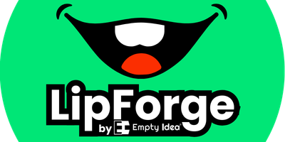

# 🎙️ LipForge Pro

<div align="center">
  
</div>

**LipForge Pro** is a high-performance, studio-grade 2D lip-sync video generator. It leverages a custom neural phoneme engine to synchronize mouth shapes with speech tracks, producing high-fidelity MP4 outputs ready for professional content creation.


---

## 🌟 Key Features

- **Neural Phoneme Engine**: High-accuracy speech analysis for English and universal hybrid models.
- **Studio Monitor**: Real-time visual feedback with responsive mouth shape previews.
- **Pro Pipeline**: 5-stage automated workflow: Analyze → Extract → Render → Encode.
- **High-Resolution Rendering**: Support for 720p, 1080p FHD, and 4K UHD exports.
- **Chroma Key Ready**: Optimized emerald green background for seamless integration into video editors.

---

## 🛠️ Technology Stack

- **Frontend**: React (Vite)
- **Desktop Shell**: Electron
- **Backend**: Node.js (Express)
- **Engines**: Rhubarb Lip Sync Core & FFmpeg

---

## 🚀 Getting Started

### Prerequisites

- [Node.js](https://nodejs.org/) (v18 or higher)
- [FFmpeg](https://ffmpeg.org/download.html) (Must be added to your system environment PATH)

### Installation

1. **Clone the repository**:
   ```bash
   git clone https://github.com/your-username/LipForge2D.git
   cd LipForge2D
   ```

2. **Install dependencies**:
   ```bash
   npm install
   ```

### Running Locally

To launch the development environment (Vite + Electron):

```bash
npm run dev
```

### Building for Production

To package the application into a standalone Windows executable:

```bash
npm run dist
```

The installer will be generated in the `dist/` directory.

---

## 📂 Project Structure

- `src/`: React frontend source code and UI components.
- `electron/`: Electron main and preload scripts.
- `server/`: Express backend handling speech analysis and rendering logic.
- `bin/`: Contains the Rhubarb binary engine and language models.
- `public/`: Static assets including mouth phoneme sets (PNG/SVG).

---

## 📄 License

LipForge 2D is licensed under the MIT License.

This project uses Rhubarb Lip Sync.
Please refer to the original Rhubarb license for its respective terms.

## 📦 Third Party Software

This application uses:

**Rhubarb Lip Sync**
[https://github.com/DanielSWolf/rhubarb-lip-sync](https://github.com/DanielSWolf/rhubarb-lip-sync)

Used under its respective open-source license. Original license text can be found in `/third-party-licenses/rhubarb-license.txt`.

---

## ❤️ Credits & Support

Developed by **EmptyIdea**. 

If this tool helps your workflow, consider supporting the continued development:
- [Patreon](https://www.patreon.com/c/emptyidea)
- [Buy Me a Coffee](https://buymeacoffee.com/emptyidea)
